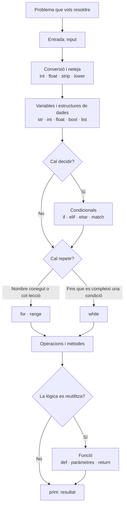
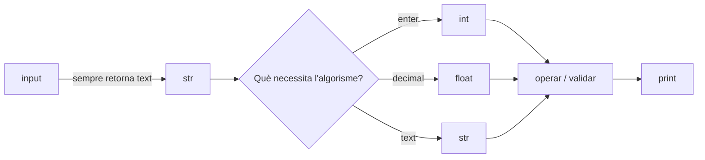
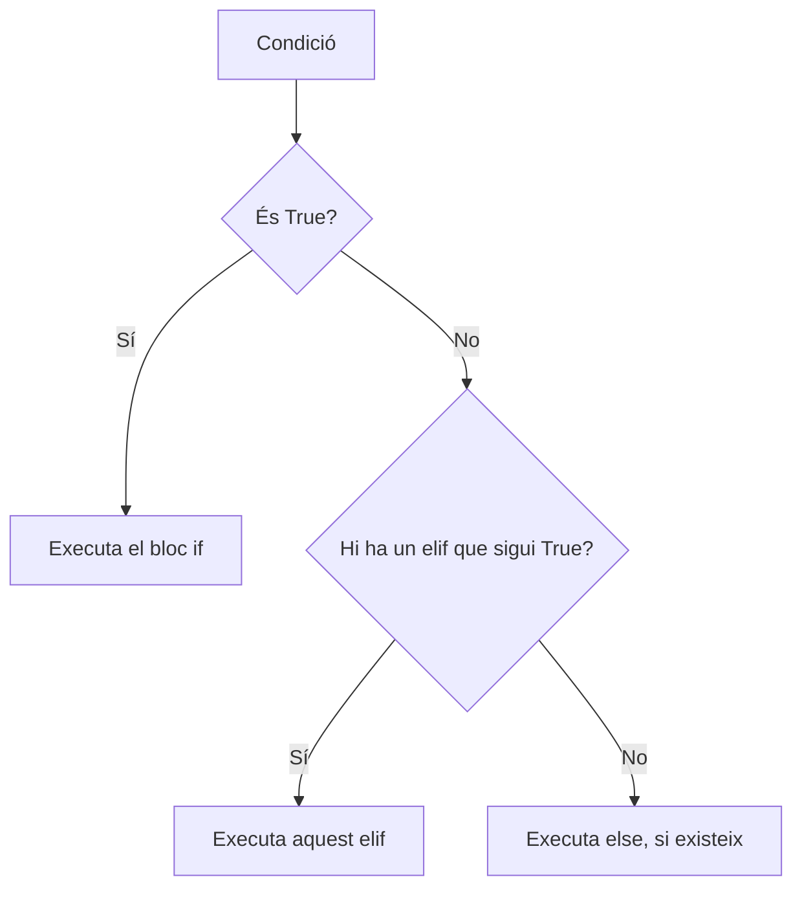
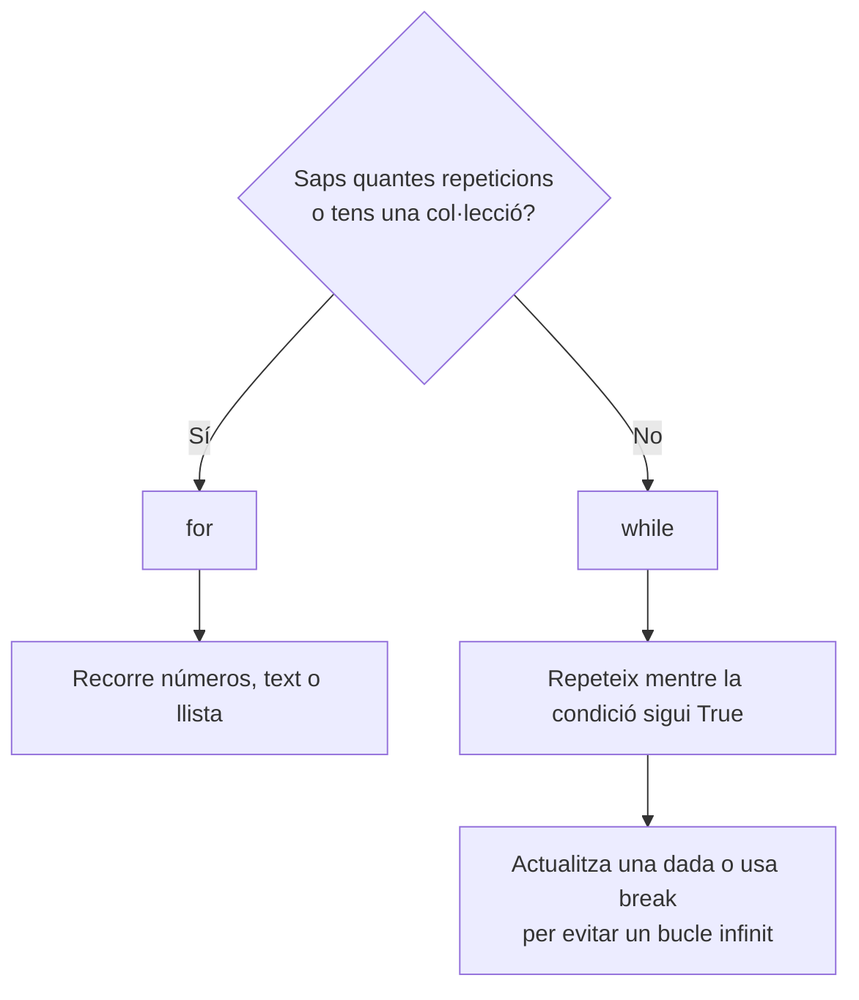
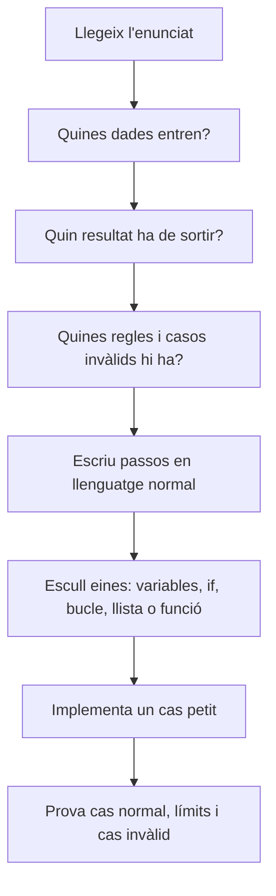

# Mapa conceptual de Python

Aquest mapa resumeix els conceptes treballats als mòduls 3–7. La idea central és simple: un programa **rep dades**, les **guarda**, les **transforma o valida**, pren **decisions** i mostra un **resultat**.



## 1. Variables i constants

Una **variable** és una etiqueta que apunta a una dada. S'utilitza quan el valor pot canviar mentre el programa s'executa.

```python
saldo: float = 1000
saldo += 200
```

`saldo` comença en `1000` i després passa a valer `1200`. Per això és una variable.

Una **constant** és una dada que, per decisió del programa, no hauria de canviar. Python no la bloqueja, però s'escriu en majúscules per avisar-ne:

```python
IVA: float = 0.21
LETTERS: str = "TRWAGMYFPDXBNJZSQVHLCKE"
```

Utilitza una constant per a regles fixes: el percentatge d'IVA, el límit d'intents, les opcions d'un menú o la taula de lletres del DNI.

> `name: str = "Anna"` és una **anotació de tipus**: explica que esperem un text. Ajuda a llegir i detectar errors, però Python no impedeix automàticament que se li assigni un altre tipus.

## 2. Tipus de dades: quin valor guardes?

| Tipus | Per a què serveix | Exemple |
| --- | --- | --- |
| `str` | Text | `name = "Anna"` |
| `int` | Nombres enters | `attempts = 3` |
| `float` | Nombres amb decimals | `price = 19.95` |
| `bool` | Només `True` o `False` | `is_valid = True` |
| `list` | Diversos valors ordenats | `students = ["Ana", "Pau"]` |
| `None` | Absència de resultat útil | `result = None` |

Escull el tipus segons el que representa la dada, no segons com es veu. Per exemple, un DNI s'ha de guardar inicialment com a `str`: conté una lletra i pot començar per zero.

## 3. Entrada, sortida i conversió



```python
age: int = int(input("Introdueix la teva edat: "))
print(f"L'any vinent tindràs {age + 1} anys.")
```

- `input()` demana una dada, però **sempre** retorna un `str`.
- `int()` converteix a enter; `float()` a decimal; `str()` a text.
- `print()` mostra un missatge o resultat.
- Una *f-string* (`f"...{variable}..."`) insereix dades dins d'un text.

Abans de convertir una entrada, convé validar-la si pot ser incorrecta. Per a enters positius escrits com a text, `.isdigit()` comprova que només hi hagi dígits.

## 4. Operadors: transformar dades i fer preguntes

| Grup | Operadors | Quan usar-los |
| --- | --- | --- |
| Aritmètics | `+`, `-`, `*`, `/`, `//`, `%`, `**` | Càlculs: mitjanes, àrees, preus, factorials. `%` retorna el residu. |
| Assignació | `=`, `+=`, `-=`, `*=`, `/=` | Crear o actualitzar una variable acumuladora. |
| Comparació | `==`, `!=`, `>`, `<`, `>=`, `<=` | Formular una pregunta amb resposta `True` o `False`. |
| Lògics | `and`, `or`, `not` | Unir o negar condicions. |

Exemple del DNI:

```python
resto = int(dni_number) % 23
letra_correcta = LETTERS[resto]
```

El residu sempre és de `0` a `22`, per tant serveix com a índex d'una taula amb 23 lletres.

## 5. Condicionals: escollir un camí

Utilitza un condicional quan la resposta depèn d'una condició.

```python
if average < 5:
    print("Has de recuperar.")
elif average <= 7:
    print("Has aprovat.")
else:
    print("Has superat el curs.")
```



- `if`: primera regla que vols comprovar.
- `elif`: regla alternativa; pot haver-n'hi més d'una.
- `else`: cas restant, quan cap condició anterior és certa.
- `match` / `case`: millor quan compares **un mateix valor** amb opcions exactes, com el codi d'un menú. Per comparar rangs (`<`, `>`) usa `if`.

## 6. Strings: treballar amb text

Un `str` és una seqüència de caràcters. Cada caràcter té una posició que comença per `0`.

```text
"Hola"
 H   o   l   a
 0   1   2   3
```

| Eina | Per a què serveix |
| --- | --- |
| `len(text)` | Saber quants caràcters té. |
| `text[0]`, `text[-1]` | Obtenir el primer o l'últim caràcter. |
| `text[inici:fi:pas]` | Retallar o recórrer el text. `text[::-1]` l'inverteix. |
| `.strip()` | Eliminar espais al principi i final. |
| `.lower()` / `.upper()` | Uniformar majúscules i minúscules abans de comparar. |
| `.replace(" ", "")` | Substituir text; així es poden treure espais. |
| `.split()` | Separar un text en una llista. |
| `" ".join(lista)` | Unir elements d'una llista en un text. |

Exemple del palíndrom: primer es neteja la frase perquè els espais i majúscules no afectin la comparació; després es compara amb la seva versió invertida.

```python
clean_phrase = phrase.replace(" ", "").lower()
is_palindrome = clean_phrase == clean_phrase[::-1]
```

## 7. Llistes: guardar molts valors

Utilitza una `list` quan una variable ha de contenir una col·lecció ordenada: alumnes, països, notes o resultats de Fibonacci.

```python
students: list[str] = []
students.append("Anna")
students.append("Pau")
```

| Operació | Ús |
| --- | --- |
| `append(valor)` | Afegir al final. |
| `insert(posició, valor)` | Inserir en una posició concreta. |
| `pop()` / `pop(posició)` | Extreure i obtenir l'últim element o un element concret. |
| `remove(valor)` | Eliminar la primera coincidència d'un valor. |
| `len(lista)` | Comptar elements. |
| `.copy()` | Crear una llista independent. |
| `in` / `not in` | Comprovar si un element ja existeix. |

Una llista és **mutable**: `append()` modifica la mateixa llista. Per això `copia = lista` no en crea una de nova; totes dues variables apunten a la mateixa llista. Usa `copia = lista.copy()` quan necessitis conservar l'original.

## 8. Bucles: repetir una acció



### `for`

Usa'l quan saps el nombre de repeticions o vols recórrer elements.

```python
for number in range(1, 6):
    print(number)
```

`range(inici, final, pas)` genera nombres. El valor final no està inclòs.

```python
range(1, 6)       # 1, 2, 3, 4, 5
range(10, 0, -2)  # 10, 8, 6, 4, 2
```

Per invertir un text amb índexs:

```python
for position in range(len(text) - 1, -1, -1):
    reversed_text += text[position]
```

També pots recórrer directament una llista o un text sense índexs:

```python
for student in students:
    print(student)
```

### `while`

Usa'l quan no saps quant trigarà a acabar: endevinar un número, demanar intents fins a encertar, o omplir cinc beques vàlides.

```python
while attempts < 5 and guess != secret_number:
    guess = int(input("Prova un altre número: "))
    attempts += 1
```

La condició ha de poder passar a `False`. Si no, el bucle no acaba. `break` permet sortir-ne abans quan apareix un cas especial, com trobar un nombre primer.

## 9. Funcions: agrupar i reutilitzar lògica

Una funció és un bloc amb una responsabilitat clara. La defineixes amb `def`; no s'executa fins que la crides.

```python
def calculate_average(total: int, amount: int) -> float | None:
    if amount <= 0:
        return None
    return total / amount

average = calculate_average(30, 5)
```

| Part | Què és i per què serveix |
| --- | --- |
| `def` | Defineix la funció. |
| `calculate_average` | Nom que descriu la seva única responsabilitat. |
| `total`, `amount` | Paràmetres: dades que la funció necessita. |
| `-> float | None` | Tipus de resultat esperat: decimal o cap resultat vàlid. |
| `return` | Acaba la funció i envia el valor calculat a qui l'ha cridada. |
| `calculate_average(30, 5)` | Crida: executa la funció amb arguments reals. |

Fes una funció quan una lògica es repeteix o quan un programa té una tasca identificable: calcular IVA, validar una edat, calcular una mitjana, detectar si un nombre és primer o calcular el factorial.

Una bona pràctica és dividir un problema gran en funcions auxiliars:

```text
Programa de mitjanes
├── is_incorrect_amount() → valida la quantitat
├── is_incorrect_grade()  → valida cada nota
└── calculate_average()   → demana, acumula i retorna la mitjana
```

És el principi de **responsabilitat única**: cada funció fa una cosa concreta, de manera que és més fàcil entendre-la, provar-la i corregir-la.

### `return` i validació anticipada

```python
def calculate_factorial(number: int) -> int | None:
    if number < 0:
        return None

    factorial = 1
    for current in range(1, number + 1):
        factorial *= current
    return factorial
```

El primer `return` evita continuar quan l'entrada és invàlida. És un *early return*: talla un camí que no pot donar un resultat correcte.

## 10. Recepta per resoldre un exercici



Preguntes útils abans d'escriure codi:

1. Què rep el programa: text, enter, decimal o una llista?
2. Què pot ser incorrecte i com ho validaré?
3. Necessito prendre una decisió? Usa `if` o `match`.
4. Necessito repetir? `for` si el límit és conegut; `while` si depèn d'una condició.
5. Necessito guardar més d'un valor? Usa una llista.
6. Aquesta tasca es podria reutilitzar o té molts passos? Crea una funció.
7. Quin resultat mostraré amb `print()` o retornaré amb `return`?

## 11. Patrons dels teus exercicis

| Problema | Patró principal |
| --- | --- |
| Mitjana de notes | `input` → conversió → càlcul → `if` per categoria. |
| Calculadora | Funcions per operació → `match` per escollir-ne una → validació de divisió per zero. |
| Endevinar número | `random` → `while` fins a encertar → comptador d'intents. |
| Beques | `while` fins a cinc resultats vàlids → llista per guardar noms → `if` per requisits. |
| Text al revés | `for` que recorre de l'últim índex al primer, o `reversed()`. |
| Palíndrom | Netejar text → invertir amb `[::-1]` → comparar amb `==`. |
| DNI | Separar número i lletra → `% 23` → índex dins una cadena → comparar. |
| Factorial / Fibonacci | Valor acumulador o recursivitat → bucle / funció → `return`. |

## Idea final

Python no es resol memoritzant cada funció. Es resol identificant l'acció que necessita el problema:

```text
Guardar una dada       → variable
Guardar moltes dades   → llista
Fer un càlcul          → operadors
Escollir un camí       → if / elif / else / match
Repetir                → for / while
Reutilitzar una tasca  → funció
Mostrar o retornar     → print / return
```
